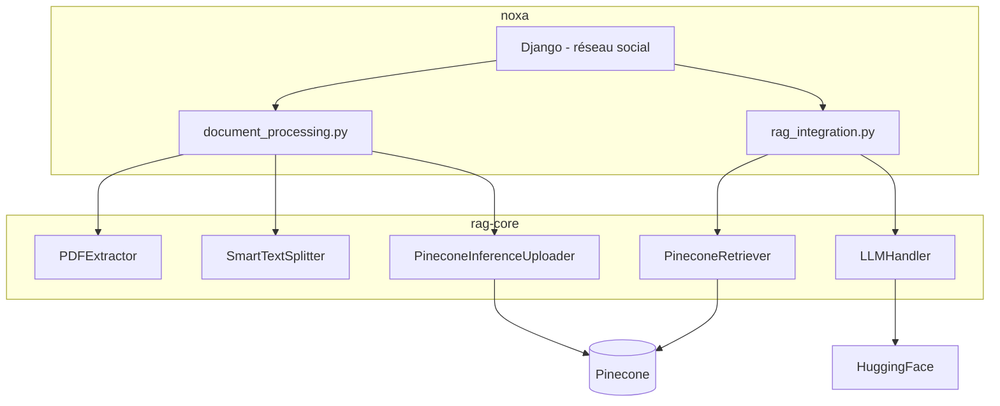
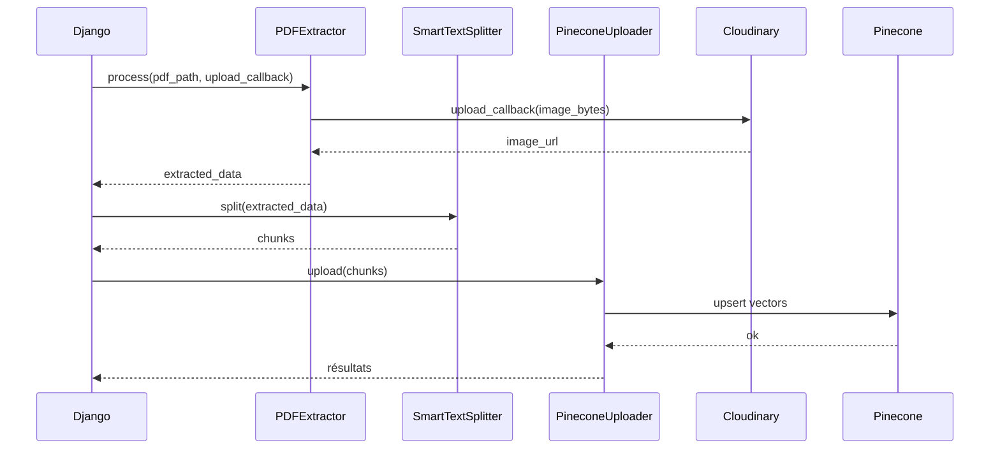
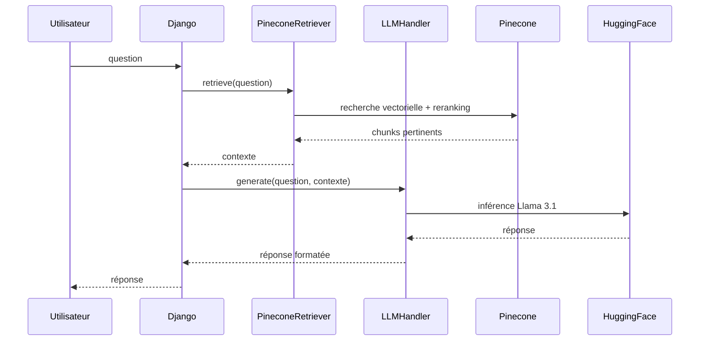
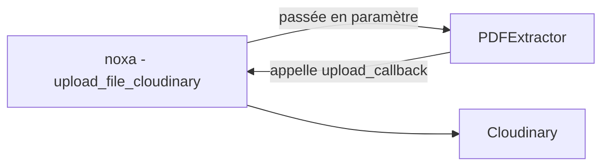

# NOXA

Plateforme académique permettant aux étudiants et chercheurs de partager des documents , avec un assistant IA (chatbot RAG) intégré.

## Architecture

NOXA est découpé en deux repos (hormis les labos qui vont arriver ...)

[noxa](https://github.com/Projet-DeepSearchSnIA/noxa) est l'application Django : réseau social académique, gestion des utilisateurs et des publications, interface du chatbot.

[rag-core](https://github.com/Projet-DeepSearchSnIA/rag-core) est la bibliothèque Python qui contient tout le pipeline RAG : extraction PDF, chunking, embeddings, récupération et génération. Elle ne dépend ni de Django ni de Cloudinary, et peut être utilisée indépendamment dans des notebooks de recherche.

La connexion entre les deux est uniquement par import Python : rag-core est installé dans le virtualenv de noxa via `pip install -e ../rag-core`.

### Vue d'ensemble des deux repos



### Pipeline de traitement d'un PDF

Quand un utilisateur uploade un document, noxa orchestre le pipeline en appelant les composants de rag-core dans l'ordre.



### Pipeline de réponse à une question (RAG)



### Injection de dépendance pour Cloudinary

rag-core communique pas avec Cloudinary. Noxa lui passe sa propre fonction d'upload en paramètre au moment de l'initialisation. Ainsi rag-core reste indépendant de toute infrastructure externe.



## Dépendance : rag-core

NOXA utilise [rag-core](https://github.com/Projet-DeepSearchSnIA/rag-core) comme bibliothèque Python externe pour tout le pipeline RAG.

## Installation

### Cloner les deux repos

```bash
git clone https://github.com/Projet-DeepSearchSnIA/rag-core.git
git clone https://github.com/Projet-DeepSearchSnIA/noxa.git
```

### Créer et activer un environnement virtuel

```bash
cd noxa
python -m venv env

# Linux / macOS
source env/bin/activate
# Windows
env\Scripts\activate
```

### Installer rag-core dans le venv de Noxa

```bash
pip install -e ../rag-core
```

### Installer les dépendances de NOXA

```bash
pip install -r requirements.txt
```

### Configurer les variables d'environnement

Copier `.env.example` en `.env` et remplir les valeurs (Django, base de données, Cloudinary, Pinecone, HuggingFace). Le faire pour les deux repos.

```bash
cp .env.example .env
```

### Lancer les migrations et le serveur

```bash
cd noxa_app/base/
python manage.py migrate
python manage.py createsuperuser   # première fois uniquement
python manage.py runserver
```

L'application est accessible sur http://127.0.0.1:8000  
L'interface admin sur http://127.0.0.1:8000/admin
